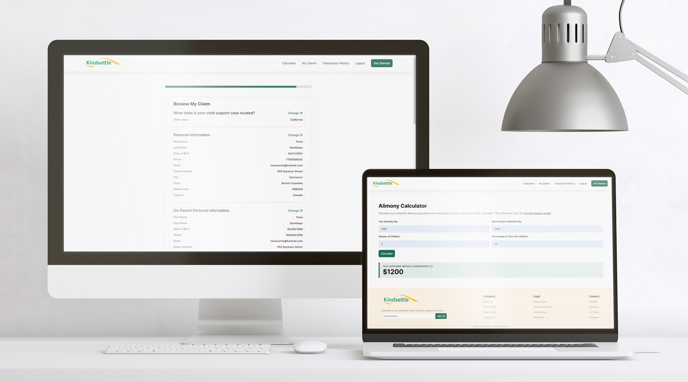
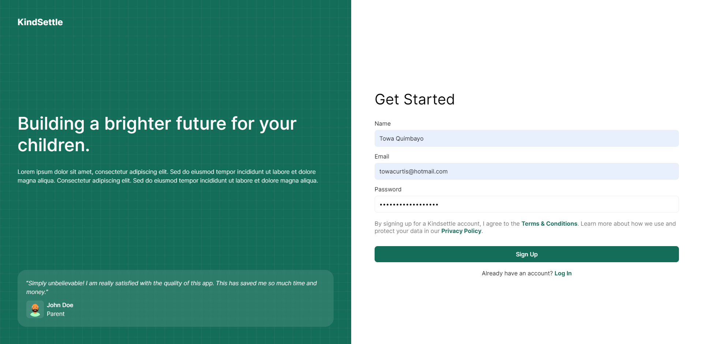
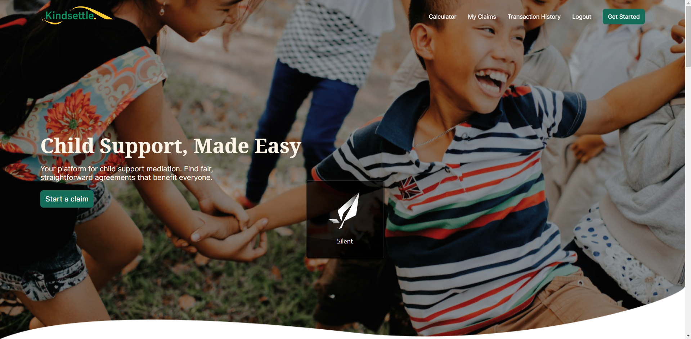
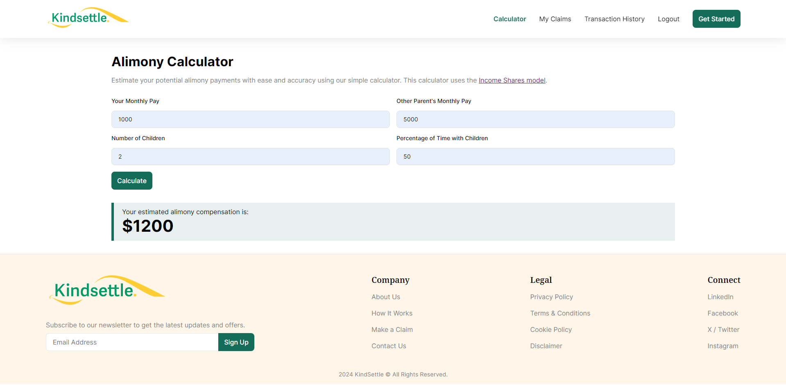
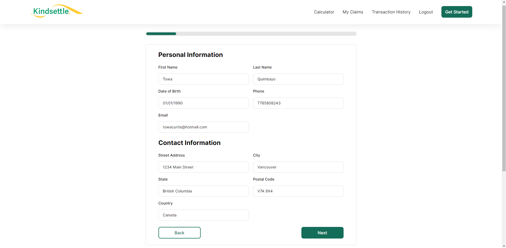
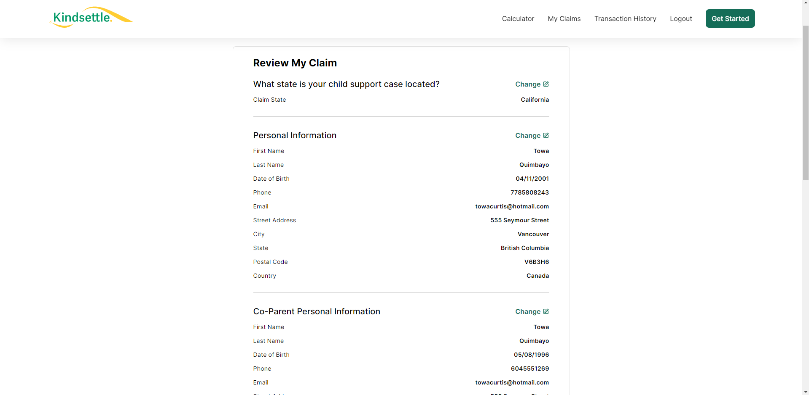
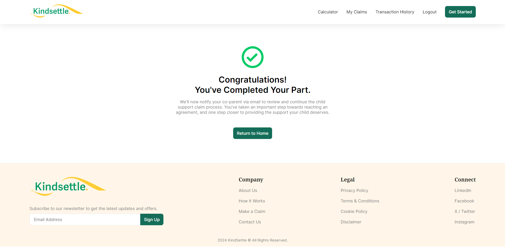

# KindSettle


An innovative legal mediation platform tailored for co-parents. It facilitates the resolution of child support matters post-divorce, eliminating the need for court involvement, thus saving time and money.

_Check out the live project [_here_](https://kindsettle.com/)._

## Table of Contents

* [Screenshots](#screenshots)
* [Acknowledgements](#acknowledgements)
* [Technologies](#technologies)
* [Usage](#usage)
  * [Prerequisites](#prerequisites)
  * [Installation](#installation)
  * [Environment Variables Setup](#environment-variables-setup)
  * [Run The App](#run-the-app)
* [Features](#features)
  * [User Authentication](#user-authentication)
  * [Alimony Calculator](#alimony-calculator)
  * [Alimony Claims System](#alimony-claims-system)
* [Awards](#awards)

## Screenshots

|  |  |
|:--:|:--:|
| _Signup Page_ | _Home Page_ |
|  |  |
| _Alimony Calculator Page_ | _Alimony Claim Page_ |
|  |  |
| _Alimony Review Claim Page_ | _Alimony Claim Completion Page_ |

## Acknowledgements

* Towa Quimbayo [GitHub](https://github.com/towaquimbayo) [LinkedIn](https://www.linkedin.com/in/towa-quimbayo/)
* Noufil Saqib [GitHub](https://github.com/noufilsaqib) [LinkedIn](https://www.linkedin.com/in/muhammad-noufil-saqib/)
* Anitha Amarnath [GitHub](https://github.com/anithaamarnath) [LinkedIn](https://www.linkedin.com/in/anitha-amarnath/)
* Antanas Dapkus [LinkedIn](https://www.linkedin.com/in/addapkus/)
* Antoni Ngo [LinkedIn](https://www.linkedin.com/in/antoningo/)

[](https://github.com/towaquimbayo/KindSettle/graphs/contributors)

## Technologies

* React.js `v18.3.1`
* CSS3
* React Helmet `v6.1.0`
* React Redux `v9.1.2`
* Redux `v5.0.1`
* Redux-Thunk `v3.1.0`
* Couchbase `v4.3.1`
* Express `v4.18.2`
* JWT Authentication `v9.0.0`
* Nodemailer `v6.9.13`
* Nodemon `v2.0.20`
* Ottoman `v2.4.0`
* TypeScript `v4.9.4`
* Zod `v3.20.2`

## Usage

<details>
  <summary>Prerequisites</summary>

### Prerequisites

* [VSCode](https://code.visualstudio.com/download/)
* [Git](https://git-scm.com/downloads/)
* [Node.js](https://nodejs.org/en/download/)

</details>

<details>
  <summary>Installation</summary>

### Installation

1. Install latest npm package version.

  ```sh
  npm install npm@latest -g
  ```

2. Clone the repository to local machine.

  ```sh
  git clone https://github.com/towaquimbayo/KindSettle.git
  ```

3. Installing required dependencies requires Node and npm.

  Change directory to Frontend and install dependencies:

  ```sh
  cd frontend
  npm install
  ```

  Change directory to Backend and install dependencies:

  ```sh
  cd backend
  npm install
  ```

</details>

<details>
  <summary>Environment Variables Setup</summary>

### Environment Variables Setup

For the project to run correctly, environment variables are required __only__ for the backend directory. Rename the `.env.example` to `.env`.

1. `JWT_SECRET` is the encryption key to sign your JWTs (JSON Web Tokens). Create a secret at <https://www.allkeysgenerator.com>.
2. `JWT_LIFETIME` is the amount of time a particular JWT will be valid for (i.e. `30d` for 30 days).
3. Sign up for a free Couchbase account, if you don't have any. Create a new Cluster and connect to it by copying the URI to `CB_URI` and filling in your `CB_USERNAME`, `CB_PASSWORD`, and `CB_BUCKET` credentials by following the documentation at <https://docs.couchbase.com/nodejs-sdk/current/howtos/managing-connections.html>.
4. Either enter your email account credentials for the Nodemailer transporter credentials or create a Gmail account to generate an App Password by following the instructions at <https://medium.com/@y.mehnati_49486/how-to-send-an-email-from-your-gmail-account-with-nodemailer-837bf09a7628>.

</details>

<details>
  <summary>Run The App</summary>

### Run The App

In order to run the application, you would need the client (frontend) and server (backend) running concurrently in different terminal sessions.

#### Client-Side Usage (Frontend) on PORT: 3000

Change directory to client (`frontend`) and execute `npm start` to run locally in development mode or production mode. For production, make sure to build the app to the `build` folder by executing `npm run build` as this would correctly bundle React in production mode and optimize the build for the best performance.

```sh
cd frontend
npm start
```

#### Server-Side Usage (Backend) on PORT: 8080

Change directory to server (`backend`) and execute `npm run dev` to run locally in development mode or execute `npm start` to run in production mode. For production, make sure to build the app to the `dist` folder by executing `npm run build` as this would correctly compile TypeScript code to ES5 JavaScript codes and optimize the build for the best performance.

```sh
cd backend
npm run dev   // running locally in development mode
npm run start // running in production mode
```

</details>

## Features

### User Authentication

Our authentication system ensures secure access to the application using JSON Web Tokens (JWT). Users can sign up and log in with a simple system requiring standard information: name, email, and password. Although we do not have a profile management system yet, our current setup provides robust security and session management.

* __Secure Authentication__: Implemented with JWT for secure authentication and session management.
* __Signup and Login__: Simple registration process and login system requiring name, email, and password.
* __Session Management__: Effective management of user sessions for security and ease of use.

### Alimony Calculator

Estimate your potential alimony payments with ease and accuracy using our simple calculator. By entering your monthly pay, co-parent's monthly pay, number of children, and percentage of time with children, the calculator provides a reliable estimate of your alimony payments. Our system is based on the income shares model, ensuring fair and accurate calculations. For more information on how child support is calculated, you can refer to [this resource here](https://divorce.com/blog/how-is-child-support-calculated/).

* __Income Shares Model__: Based on a widely used model in the United States (US) for accurate calculations.

### Alimony Claims System

Manage your alimony claims efficiently with our comprehensive alimony claims system. Users can add, edit, and view their alimony claims seamlessly. The claim creation process involves a series of form steps to enter personal information, co-parent information, number of children, monthly net income, and more. After you file your half of the claim, your co-parent is required to sign up and complete their half. Once both halves are submitted, the claim can be viewed and finalized.

* __Claim Management__: Add, edit, and view alimony claims.
* __Collaborative Filing__: Both parties must complete their halves of the claim for submission to ensure the information is verified and correct.
* __Review and Submit__: Claims can be reviewed and finalized once both parties have submitted their information.

## Awards

KindSettle has received significant recognition for its impact and innovative use of technology. At the Beeloud & Build AI Hackathon, we were honored with the following awards:

* __1st Place Certification for "Most Impactful"__: Our project stood out for its potential to make a meaningful difference in the lives of co-parents, simplifying legal mediation and reducing the need for court involvement.
* __1st Place Certification for "Best Use of Couchbase Database"__: By leveraging Couchbase, we efficiently managed and stored data, showcasing our effective use of this powerful technology. Couchbase, one of the event's sponsors, acknowledged our exceptional implementation of their database solutions.

These awards reflect our commitment to creating a high-impact, user-friendly platform using cutting-edge technologies.

For more details, you can read the full article on [Couchbase's blog here](https://www.couchbase.com/blog/beeloud-and-build-hackathon-2024/) and our [Devpost submission here](https://devpost.com/software/kindsettle-com-child-support-made-easy).
